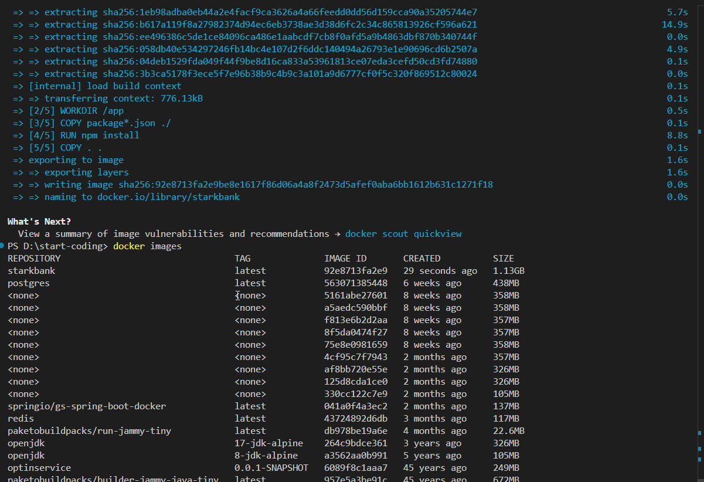
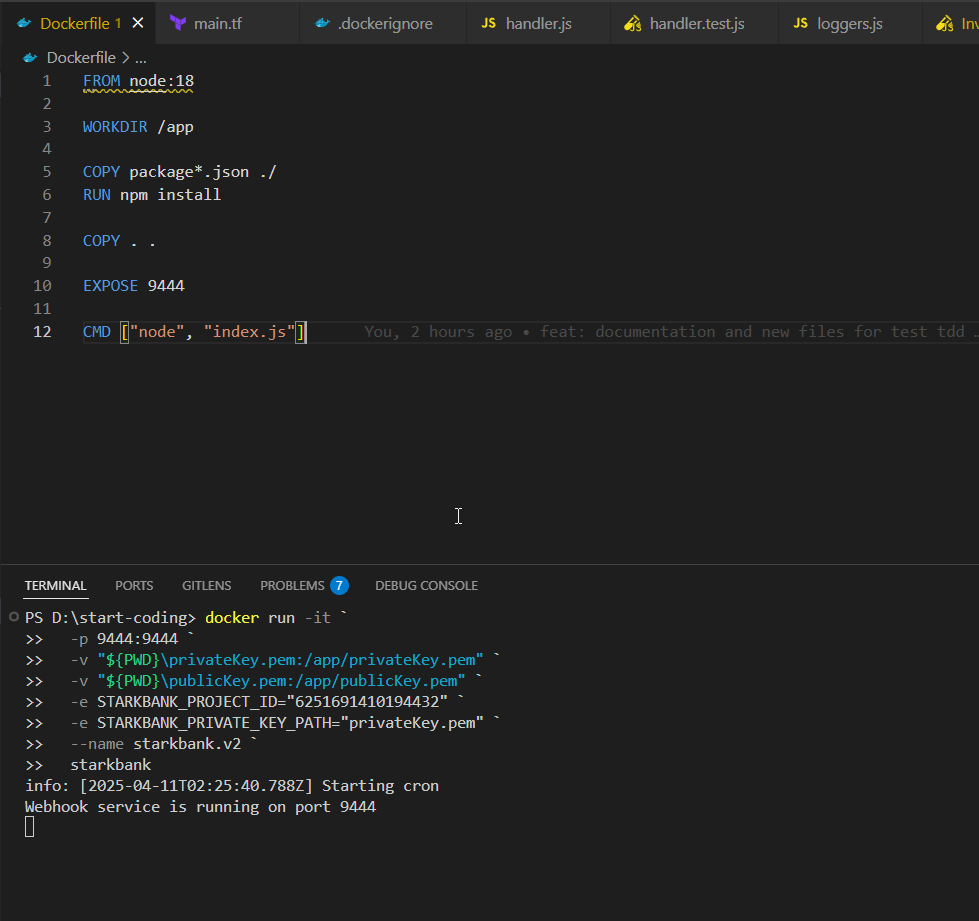

# start-payments

## Desafio backend - Sênior

## Apresentação

Sou Wellington Da Silva Bezerra, engenheiro de software com foco em desenvolvimento backend, infraestrutura e arquitetura de sistemas. Tenho experiência sólida com tecnologias como Java, Node.js, Python, além de práticas DevSecOps, monitoramento e integração de sistemas críticos e com experiências no mercado financeiro como CIP (Núclea), Magalu pay (Pix), C6bak, XP e Itaú Unibanco.

Meu trabalho se destaca pela clareza na organização do código, atenção à segurança e busca por soluções simples para problemas complexos. Este projeto reflete minha experiência em integração com APIs externas (como StarkBank), validação segura de webhooks, agendamentos automáticos e deploy seguro em ambientes cloud.

### Contato

- Email: <wellingtons.bezerra@hotmail.com>
- Telefone: (11) 99001-3439
- LinkedIn: [linkedin.com/in/wellington-bezerra-dev](https://linkedin.com/in/wellington-bezerra-dev)

Fico a disposição para esclarecer qualquer dúvida que surgir

Próximos passos que pretendia realizar:

- Conceitos de CI/CD automatizados como deploy da imagem via GitHub Actions
- Infra as a code com terraform

Vamos iniciar com o setup da aplicação pela descrição sugerida no desafio. Criar uma aplicação que receba resultados enviados pela StarkBank via webhook e um cenário ficticio de envios a cada 3 horas para processamento de dados.

## setup

Versões e ferramentas utilizadas:

- Nodejs 18.18.0
- Docker
- Terraform

Explicação de cada biblioteca no setup da aplicação.

```bash
# express for api framework
# starkbank sdk
# dotend env vars
# node-cron for schedules requesting for processing data
# body parser for utils to framework
npm install express starkbank dotenv node-cron body-parser
# loggers
npm install winston
# tests
npm i jest
```

Variáveis de ambiente

```bash
# Porta da aplicação facilidade em esteiras CI/CD e clusters (ECS | EKS)
PORT=9444
# Chave secreta para interação com StarkBank SDK ou API
SECRET_STARKBANK="path_or_content_key"
# Chave do projeto na plataforma da StarkBank.
STARKBANK_PROJECT_ID="id_project"
```

## ⚠️ Atenção

As chaves foram carregadas no git apenas para nível de avaliação:
 `privateKey.pem` e `publicKey.pem` como menciono em algumas praticas na AWS essas chaves devem ser extramamente restritas.

## Modelagem do projeto

Utilizei uma forma simples e objetiva para realização do teste, as pastas criadas são separadas por responsabilidade e forma de programação foi mais objetiva no sentido de funções com única responsabilidade contribuindo para siplicidade das ações a serem realizadas. Contudo abordando as principais funcionalidades do desafio.

Aplicações que

Explicação modelagem dos arquivos

src       : source padrão de mercado e padronização do código fonte.
controller: responsável pela camada controladora para nosso desafio e padrão de API.
jobs      : responsável pelo gerenciamento das tarefas agendadas.
services  : responsável pelas regras de negócio sugeridas e algumas para funcionalidade do projeto (conexão externa, segurança)
utils     : responsável para funções utilitárias no nosso desenvolvimento.

## Goals

Evidências das funcionalidades sugeridas:

Invoices


Transfers


Ngrok para ambiente simulado localmente


## Segurança

Este projeto implementa a verificação de assinaturas digitais recebidas via Webhook da StarkBank, garantindo a integridade e autenticidade dos eventos.

Utiliza o método starkbank.event.parse() para validar a assinatura usando a chave pública da StarkBank.

O corpo da requisição é processado em formato bruto (express.raw) para garantir que a assinatura não seja invalidada por modificações.

Apenas eventos do tipo invoice.credited são processados.

A chave pública da StarkBank deve ser salva localmente pra fins do teste mas em ambiente real seria em um serviço como AWS SECRET MANAGER.

### Webhook Headers verificação

Dentro do retorno da API implementei uma verificação da origem dos dados, garantir que o webhook seja da StakBank e seja válido com a autenticação usando o SDK da empresa.

### Autorização SDK StarkBank

Implementado também a autorização da sessão dentro do SDK : <https://starkbank.com/docs/api#authentication>
Em AuthStarkBank.js realizei a implementação para interação com API caso necessário.

### Segurança na API Retries

Realizando alguns testes a propria SDK e plataforma do StarkBank utilizam uma propriedade contra retries.
Nesse exemplo que estou enviando até o momento não tem tratamento por um database que controlaria esse retries com mecanismos de idêmpotencia nos envios.

### Gerenciamento Ratelimits

Rate Limits - Avaliar limites de requisição por um tempo determinado pela equipe. Isso é muito útil para prevenir ataques de DDOS (negação de serviço) e controle de acesso por origem aos nossos recursos.

## Infra - Cloud

Atribui algumas documentações sobre a disponibilização do nosso novo serviço em ambiente de cloud (AWS) tenho experiências atuando com AWS fiz um diagrama simplificado para avaliação.


Recursos como:

- Fargate: Recurso auto gerenciado pela AWS nos ajuda para disponibilização dos nossos serviços com alta capacidade de disponibilidade.
- Secret Manager: Usado para gerenciamento de dados sensíveis como chaves para API e configurações sensíveis como acesso a banco de dados.
- Certificate Manager: Para gerenciar nossas chaves.
- ECS ou EKS: Recursos de clusterização com máquinas ou serviços no caso de EKS. Nos ajuda a ter um ambiente de alta disponibilidade, auto scalling e controle de degradação do ambiente.
- WAF: Muito utilizado como Firewall das nossas aplicações web, controle de acessos e segurança.

## Docker

Configuração de container para aplicação.

```bash
# Build imagem
docker build -t starkbak .


# Executar aplicação powershell (compatibilidade com path)
docker run -it `
   -p 9444:9444 `
   -v "${PWD}\privateKey.pem:/app/privateKey.pem" `
   -v "${PWD}\publicKey.pem:/app/publicKey.pem" `
   -e STARKBANK_PROJECT_ID="6251691410194432" `
   -e STARKBANK_PRIVATE_KEY_PATH="privateKey.pem" `
   --name starkbank.v2 `
   starkbank
```

### Construção e Execução da imagem

Build



Running


